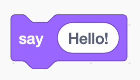
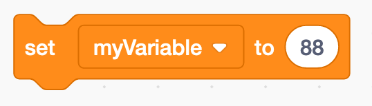
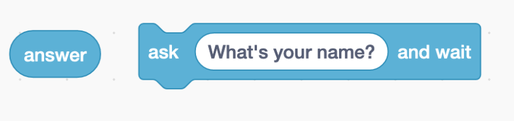
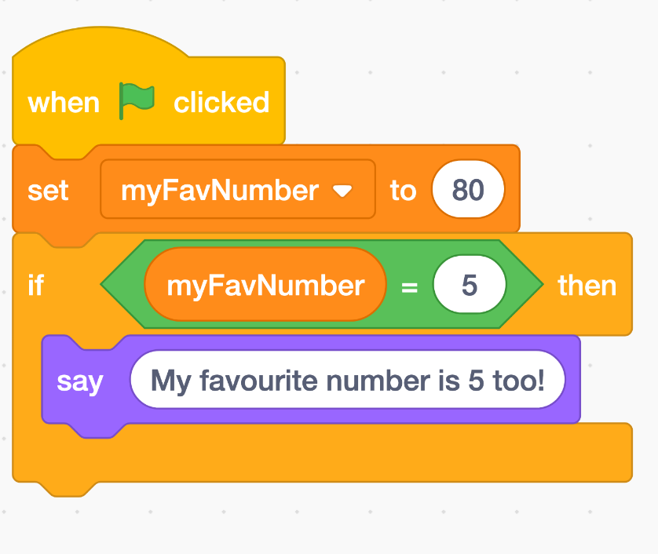
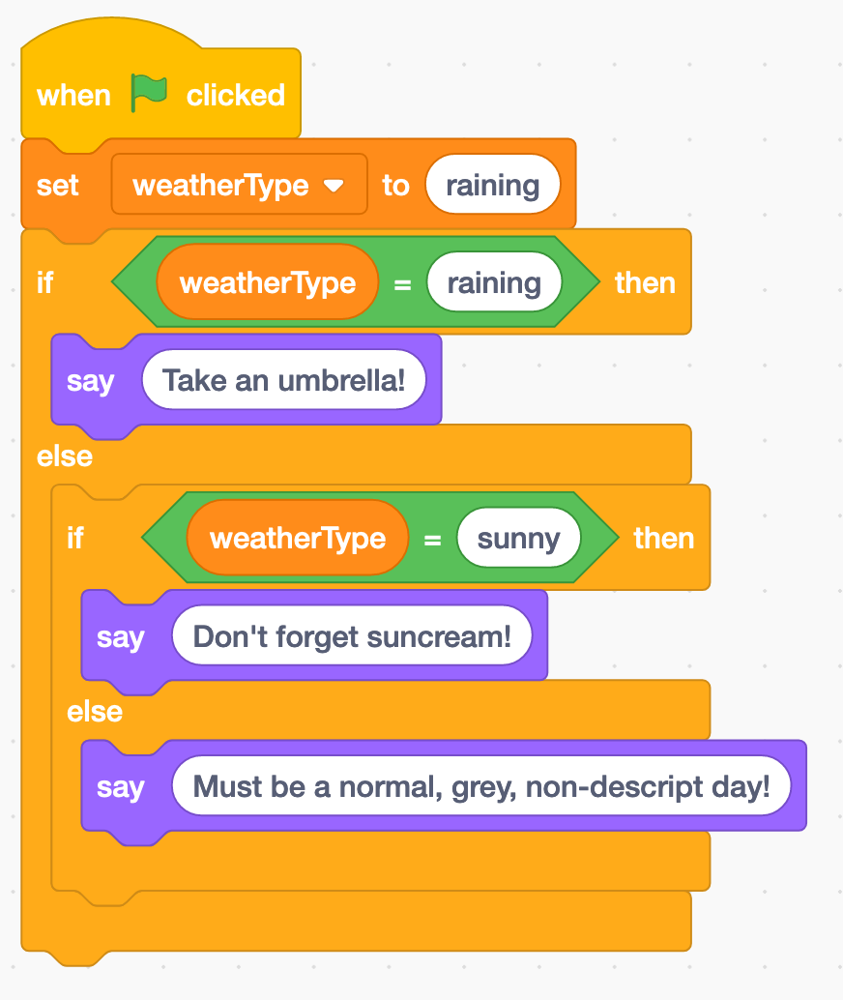

# JS 101 - Conditional Statements

Do these tasks in the JS file that you just linked to the HTML in the previous activity.

Conditional statements allow us to write programs that perform different actions with logic depending on the situation. The main way we write these is with `if`, `else` and `else if` statements.

### The basic if:

```js
if (condition) {
  // code to run if condition is true
}
```

Inside the smooth brackets, the if statement expects a expression that resolves to `true` or `false`. This is called a boolean expression.

Examples of boolean expressions:

- `1 > 3` (false)
- `1 === 1` (true)
- `8 < 10` (true)

```js
if (1 > 3) {
  console.log("Well, duh! Of course 1 isn't greater than three...");
}
```

In this example, one is always going to be greater than three; that won't change. In our code, however, we will usually be checking something that can change like a variable.

```js
let numberOfPies = getPieCount();

if (numberOfPies < 1) {
  console.log("Who ate all the pies???");
}
```

### If/else:

The else statement below the if statement will run if the the previous ifs or if elses have not run (so if the conditions in the other ifs/if elses have evaluated to false). There can **only** be one else statement, and it **must** be the last in the chain.

```js
let numberOfPies = getPieCount();

if (numberOfPies < 1) {
  console.log("Who ate all the pies???");
} else {
  console.log("We have pies! Who's hungry?");
}
```

### Else If

You can put as many else ifs in as you like, but they **cannot** be first, as the chain must always start with an if. You **must** supply a condition for an else if statement.

```js
let numberOfPies = getPieCount();

if (numberOfPies < 1) {
  console.log("Who ate all the pies???");
} else if (numberOfPies < 5) {
  console.log("Not many pies left, get them whilst you can!");
} else {
  console.log("We got pies! Who's hungry?");
}
```

## Exercises

We are going to use our newfound JavaScript skills and our existing knowledge of Scratch to translate some blocks to real code.

For example this block...



Could be translated to JavaScript like so...

```js
console.log("Hello!");
```

This block...



in JS could be...

```js
let myVariable = 88;
```

This block...



could be...

```js
let answer = alert("What's your name?");
```

Your task now is to translate the following code blocks into JavaScript.

### Task 1



### Task 2


### Task 3


