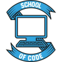

# Workshop - React JavaScript to TypeScript

This workshop has a basic functioning to-do list app put in place already. The aim is to convert all the `.js` components to `.tsx` components. Spend a few minutes looking through the code to get an understanding of what each component does. Run the app locally and see how it works.

All the relevant TypeScript packages have already been added.

Remember that TypeScript tries to stay out of your way. You don't always have to explicitly type things.

## Task 1

Convert the `App.js` and `Header.js` components to TypeScript components (`App.tsx` and `Header.tsx` respectively).

## Task 2

Convert the `AddTodo.js` component to a TypeScript component.

## Task 3

Convert the `TodoTitle.js` and `TodoButtons.js` components to TypeScript.

## Task 4

Convert the `Todo.js` component to TypeScript.

## Task 5

Convert the `TodoList.js` component to TypeScript

## Bonus Task

Extend the app however you'd like, only using TypeScript.
