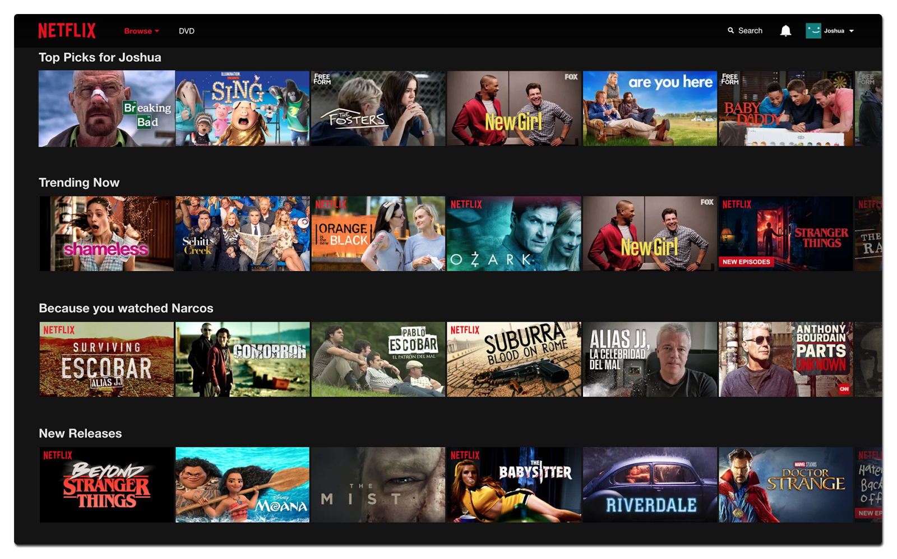
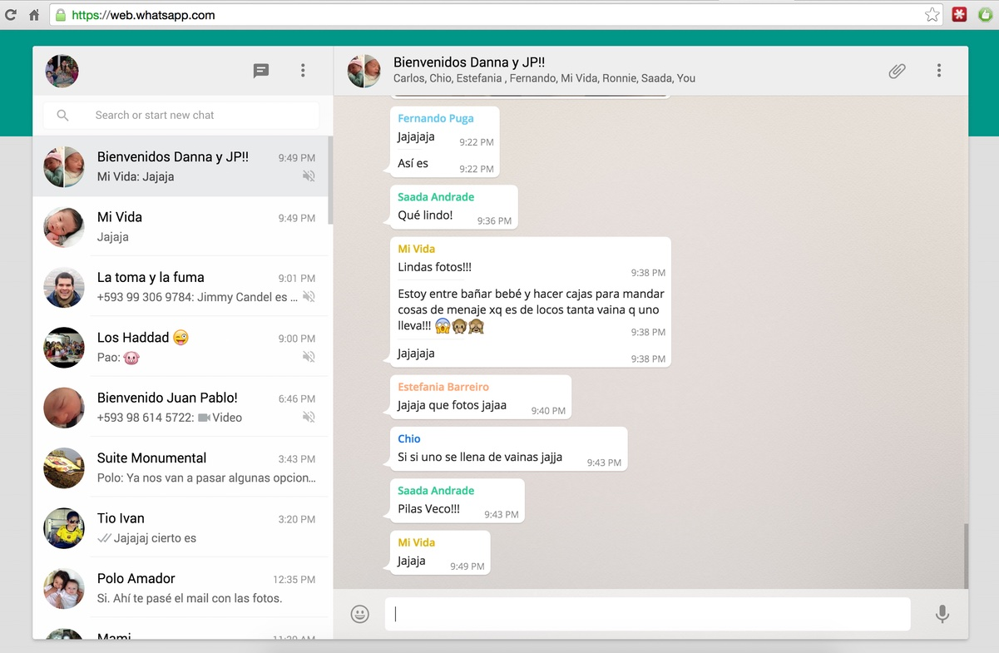
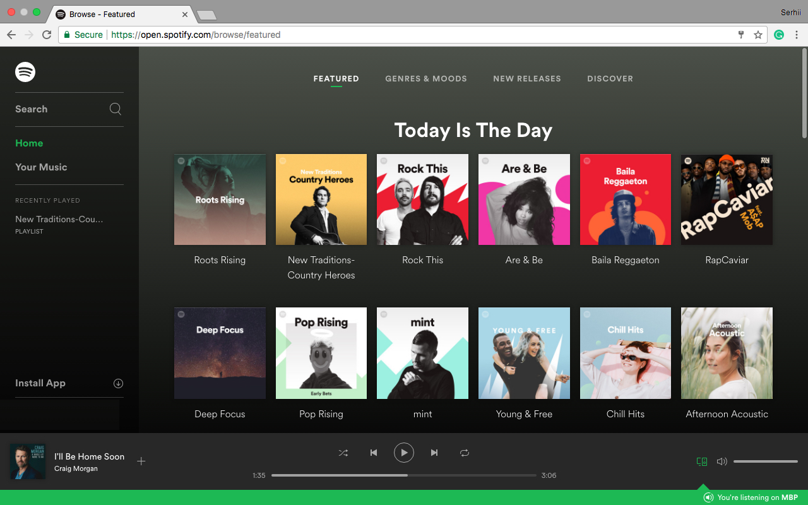

    

<h1 align="center">
  Clone a Site
</h1>

Now that we've spent time looking at UX, UI, and design, we'll lay down the CSS gauntlet to challenge you to clone a well-known site.

Break down the site's design, and tackle it bit by bit. Focus on creating a one-page experience, and be realistic - these sites take years to build, so get as far as you can during class and make some initial progress (although you can keep working on it afterward!).

Tips:

- When you're breaking down the website, write a plan of what you're going to do. Break down the site's design using your computational thinking - look for patterns and write a plan of how you'll tackle each part. Remember when you were breaking down websites at the beginning of the course and circling similarities.
- You can use online resources for placeholder images such as [placeholder.com](https://placeholder.com/) - this way, you can focus on your CSS and design first and then just swap out the image URLs later on for real images.
- We've been through how to structure CSS, naming conventions, and different tools to make layouts easier (like grid and flexbox), so remember to take advantage of everything we've learned this week.

Choose from the following:

